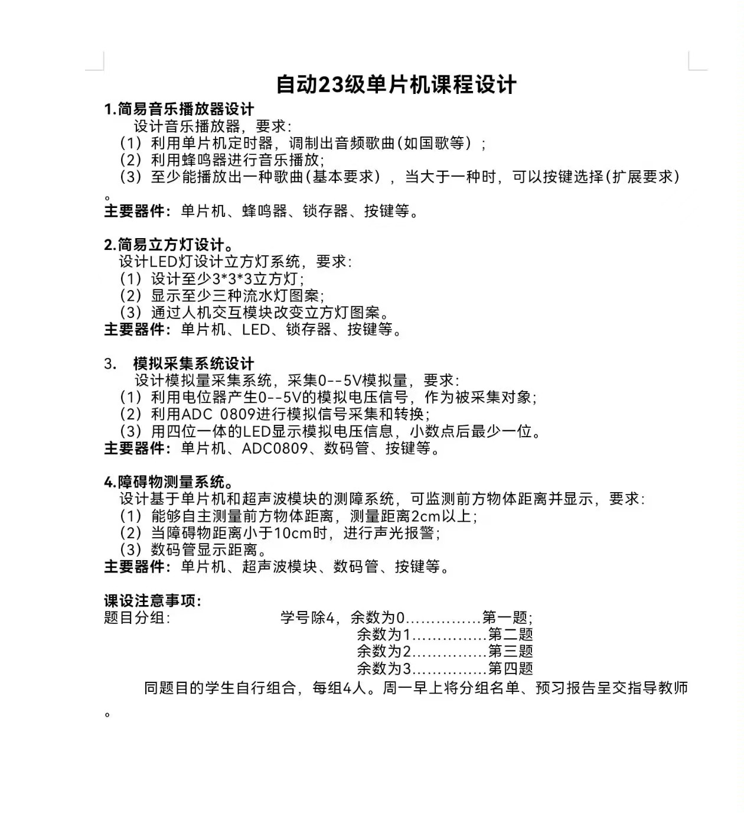

# 单片机课程设计项目 - 自动23级

本项目包含多个基于 **STC89C52RC** 和 **STM32F103C8T6** 的单片机系统设计任务，来源于自动化专业2023级单片机课程设计要求。

## 📂 项目结构与分支说明

本仓库包含三个分支，分别实现了不同平台上的不同课设任务：

| 分支名      | 单片机平台       | 实现任务                      |
|-------------|------------------|-------------------------------|
| `main`      | STC89C52RC       | 障碍物测量系统（任务四）     |
| `buzzer`    | STC89C52RC       | 简易音乐播放器（任务一）     |
| `master`    | STM32F103C8T6    | 障碍物测量系统（任务四）     |

---

## ✅ 功能简介

### 1️⃣ `main` 分支：障碍物测量系统（STC89C52RC）

- 使用超声波模块检测障碍物距离；
- 小于10cm自动蜂鸣报警；
- 数码管动态显示距离值；
- 附带任务说明图和演示视频。

🔗 [点击观看 Bilibili 视频演示](https://www.bilibili.com/video/BV12PMWzjEBB/?vd_source=2f09cfe4b835884bc8ba87373410b47d)

---

### 2️⃣ `buzzer` 分支：简易音乐播放器（STC89C52RC）

- 使用蜂鸣器播放多首乐曲；
- 按键 1 实现暂停 / 播放切换；
- 按键 2 实现切歌功能；
- 支持多首歌曲的循环播放。

🔗 [点击观看 Bilibili 视频演示](https://www.bilibili.com/video/BV12PMWzjEv3/?vd_source=2f09cfe4b835884bc8ba87373410b47d)

---

### 3️⃣ `master` 分支：障碍物测量系统（STM32F103C8T6）

- 与 `main` 分支功能相同，但使用 STM32 平台开发；
- 借助 HAL 库进行定时器配置与超声波测距；
- 同样在数码管上显示距离；
- 更适合拓展高精度/高性能场景。

🔗 [点击观看 Bilibili 视频演示](https://www.bilibili.com/video/BV1yMMWzCEJB/?vd_source=2f09cfe4b835884bc8ba87373410b47d)

---

## 🔧 开发环境

### STC89C52RC

- 开发软件：vscode + eide插件
- 烧录工具：USB转串口
- 晶振频率：12MHz
- 编程语言：C（基于 reg52.h）

### STM32F103C8T6

- 开发软件：STM32CubeMX + Clion
- 烧录方式：ST-Link
- 使用 HAL 库
- 编程语言：C

---

## 📎 课程背景

该课程设计任务四项选题内容如下：

1. 简易音乐播放器设计  
2. 简易立方灯设计  
3. 模拟采集系统设计  
4. 障碍物测量系统设计  

---

## 📷 任务说明图

> 以下为项目任务分配说明图（已包含在 `doc/任务详情.jpg`）：



---

## 📌 使用说明

切换到不同分支可查看对应平台的工程代码：

```bash
git checkout main      # STC89C52RC 障碍物测量系统
git checkout buzzer    # STC89C52RC 音乐播放器
git checkout master    # STM32F103C8T6 障碍物测量系统
